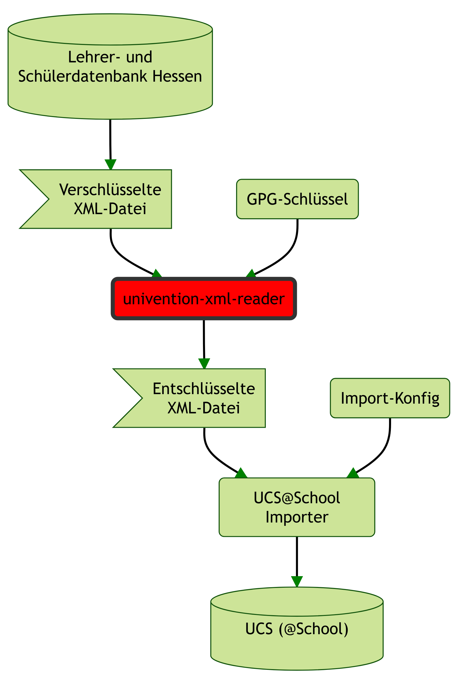

## Package: univention-ksan-xml-reader

Custom UCS@school import reader class for customer Stadt Kassel. Reads a PGP encrypted XML file instead of a CSV file.



### Usage

Activate in JSON configuration with:
```json
{
	"classes": {
		"reader": "ksan.xml_reader.XmlReader"
	},
	"configuration_checks": ["defaults", "ksan_checks", "ksan_class_level_checks", "ksan_fix_no_class_in_input_data_checks"],
	"gpghome": "/var/lib/...",
	"passphrase_file": "/etc/...",
	"lusd_normalize_classes": true,
	"lusd_lkkassel_normalize_classes": true,
	"lusd_fix_no_class_in_input_data": {
		"key_name": "Klassenname",
		"class_name": "KeineKlasse"
	},
	"class_level": {
		"key": "ksanKlassenstufe",
		"mapping": {
			"^0(?P<class_level>[0-9])/[1,2]$": "$class_level",
			"^10/[1,2]$": "10",
			"^E[1,2]$": "11",
			"^Q[1,2]$": "12",
			"^Q[3,4]$": "13",
			"^-/[1,2]$": ""
		},
		"unknown_is_error": true
	}
}
```
Make `/var/lib/ucs-school-import/configs/user_import_http-api.json` a symlink of `/var/lib/ucs-school-import/configs/user_import.json`, if the HTTP-API should be used.

The content of the file with the passphrase is expected to be a base64 encoded string.

python-gnupg in version <0.4 doesn't support GnuPG 2.1. Unfortunately that is the combination in UCS 4.3 and 4.4. To import the keys in a format the python-gnupg can handle, use gpg version `1`:
```bash
mkdir /root/importgnupg
chmod 700 /root/importgnupg
gpg1 --homedir /root/importgnupg --import schoolimporttool.key
```

Details about the required GPG keys can be found here: <https://hutten.knut.univention.de/dokuwiki/kunden:lusd>

### Normalization
Different users of this reader have different requirements for normalization. Currently the following methods exist:

#### Class names: use everything after the last '/'
Requested by 20677

"lusd_normalize_classes" was specifically requested because the "Klassenname" field in LUSD exports is regularly filled with values like this:
```
-/ngui
```
The customer can't change these values and requested an extension to make the import only use everything **after** the slash. Activating "lusd_normalize_classes" makes the import use the following regex to find patterns as above in the input data and remove them.
```
.*\/
```


#### Class names: remove beginning '-/' and convert all other '/' to '-'
Requested by 39720

"lusd_lkkassel_normalize_classes" does the following:

-/1a/test/klasse -> 1a-test-klasse


#### Class names: Missing class name
Requested by 31092

Some users don't have a class name at all. A customer request a dummy class name to be added in such cases:

"lusd_fix_no_class_in_input_data": {
	"key_name": "Klassenname",
	"class_name": "KeineKlasse"
},

- key_name identifies the name of the key containing the class name in the input data
- class_name defines the name of the dummy class to be added to the user object before import

The `class_level` configuration tree determines the interpretation of data in the `ksanKlassenstufe` column/item:

* `key` is the name of the item (in XML) or the column (in CSV). It must exist as value in `csv:mapping`.
* `mapping` is used to modify data found in the item.
  * It is a mapping from a regular expression to a value.
  * If the regular expression matches the data in the item, the item will be set to the value.
  * If the value is `$class_level` and the regular expression contains a symbolic group name capturing a part of the regular expression, then the items value will be set to the groups value.
  * If the value is `ignore`, a INFO level message will be logged and the items value will not be changed and will be set on the user.
* `unknown_is_error` determines what should happen if no regular expression matches the data in the item. If set to `true` it will be counted as an import error, if `false` a warning will be logged, but it will be ignored otherwise.
